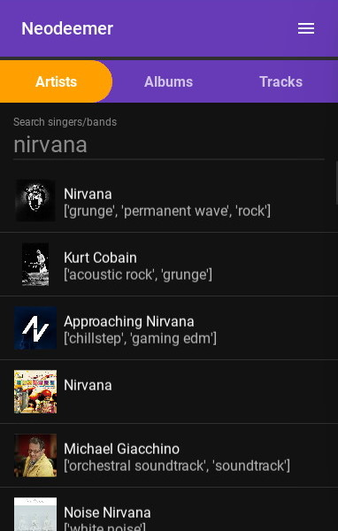
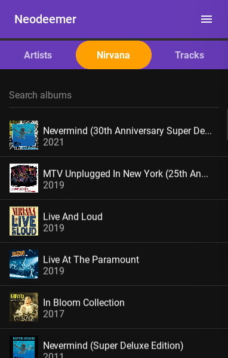
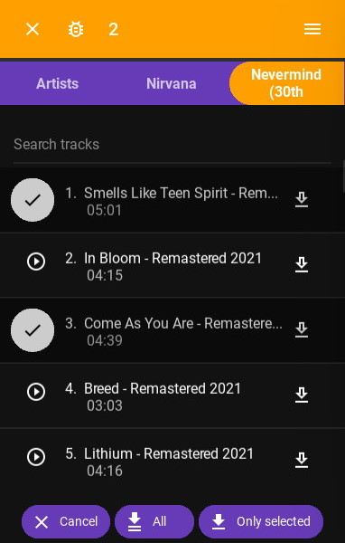
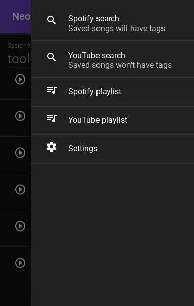

[](https://github.com/Tutislav/neodeemer/releases/latest)

# Neodeemer
[](https://github.com/Tutislav/neodeemer/releases/latest)
[](https://github.com/Tutislav/neodeemer/releases/latest)
[](https://github.com/Tutislav/neodeemer/blob/main/LICENSE)
[](https://www.softpedia.com/get/Internet/Download-Managers/Neodeemer.shtml#status)\
[](#installation)
[](#installation)
[](#running-from-source)

Spotify/YouTube song downloader with option to download whole albums, playlists and also lyrics.\
Available on [**Android**](#installation), [**Windows**](#installation) and [**Linux***](#running-from-source "You must run it from source").

## **[▶Download latest release◀](https://github.com/Tutislav/neodeemer/releases/latest)**

## Features
- Spotify/YouTube search - you can search by artist, album or track name
- Play songs before you download it
- Download single songs or whole albums
- Download whole Spotify/YouTube playlists - saved to `.m3u` file
- Download songs from share screen - tap share in Spotify/YouTube app on Android
- Automatically save track name, artist name, album image and other tags to songs
- Lyrics - embedded directly to audio files
- Synchronized lyrics - saved to `.lrc` files
- Change audio format - `m4a` or `mp3`
- [Browser Extension](#browser-extension) - download music directly from YouTube video page

## Screenshots
<picture>
    <source media="(prefers-color-scheme: light)" srcset="img/neodeemer_screenshot_1_light.jpg">
    
</picture>
<picture>
    <source media="(prefers-color-scheme: light)" srcset="img/neodeemer_screenshot_2_light.jpg">
    
</picture>
<picture>
    <source media="(prefers-color-scheme: light)" srcset="img/neodeemer_screenshot_3_light.jpg">
    
</picture>
<picture>
    <source media="(prefers-color-scheme: light)" srcset="img/neodeemer_screenshot_4_light.jpg">
    
</picture>

## Installation
### Android
1. [Download neodeemer_android.apk](https://github.com/Tutislav/neodeemer/releases/latest)
2. Open downloaded apk and install it

If it says you can't install unknown apps, just go to Settings and search Install unknown apps, then select your browser and tap Allow from this source.
### Windows
1. [Download neodeemer_windows.exe](https://github.com/Tutislav/neodeemer/releases/latest)
2. Just open the downloaded exe (It doesn't require installation)

## Running from source
1. Install Python 3.8.10 or later if you don't have it already
2. Clone this repo
3. Get your own [Spotify](https://developer.spotify.com/dashboard/) and [YouTube](https://developers.google.com/youtube/v3/getting-started) API keys
4. Create `.env` file in `neodeemer\neodeemer` (folder where is main.py) like this:
    ```dotenv
    SPOTIPY_CLIENT_ID=
    SPOTIPY_CLIENT_SECRET=
    YOUTUBE_API_KEY=
    ```
5. Continue depending on your platform
### Windows
```cmd
cd neodeemer\neodeemer
python -m venv venv
venv\Scripts\activate
pip install -r requirements.txt
python main.py
```
### Linux
```bash
cd neodeemer/neodeemer
python3 -m venv venv
source venv/bin/activate
pip install -r requirements.txt
python3 main.py
```

## Browser Extension
You can install Neodeemer UserScript to download music directly from YouTube video page.
1. Install [TamperMonkey](https://chrome.google.com/webstore/detail/tampermonkey/dhdgffkkebhmkfjojejmpbldmpobfkfo) to your browser
2. Install [Neodeemer UserScript](https://raw.githubusercontent.com/Tutislav/neodeemer/main/neodeemer/utils/userscript.user.js)
3. Start Neodeemer
4. Enable WebApi in Neodeemeer settings
5. Go to any YouTube video and click Neodeemer icon under the video, it will add video to download queue
### Download to different device
1. Click on TamperMonkey extension
2. Go to *Control Panel > Installed Scripts > Neodeemer UserScript*
3. Change `localhost` to `yourdeviceip` on these lines:
    ```js
    // @connect         yourdeviceip
    ```
    ```js
    const host = "yourdeviceip";
    ```
    where `yourdeviceip` is IP adress of device you want to control (e.g. 192.168.0.123).\
    You can get your device IP depending on your OS:\
    Android - *System Settings > Wi-Fi > YourNetwork > IP Address*\
    Windows - *cmd > ipconfig > IPv4 Address*\
    Linux - *terminal > ip addr > inet*

## Issues
If encounter some tracks, that has bad quality or even doesn't match the name, you can submit it directly in the app using
<picture>
    <source media="(prefers-color-scheme: light)" srcset="img/bug_outline_light.png">
    
</picture>
icon, when you select track.\
If you have other issue or some idea to make the app better, just open a new issue on GitHub.

## Acknowledgments
This app wouldn't be possible to make without these libraries:
- [Kivy](https://kivy.org/)
- [KivyMD](https://github.com/kivymd/KivyMD)
- [Spotipy](https://github.com/plamere/spotipy)
- [youtube_search](https://github.com/joetats/youtube_search)
- [ytmusicapi](https://github.com/sigma67/ytmusicapi)
- [pytube](https://github.com/pytube/pytube)
- [yt-dlp](https://github.com/yt-dlp/yt-dlp)
- [Spotify Lyrics API](https://github.com/akashrchandran/spotify-lyrics-api)
- [music-tag](https://github.com/KristoforMaynard/music-tag)
- [FFPyPlayer](https://github.com/matham/ffpyplayer)
- [Plyer](https://github.com/kivy/plyer)
- [python-dotenv](https://github.com/theskumar/python-dotenv)
- [Requests](https://github.com/psf/requests)
- [Unidecode](https://github.com/avian2/unidecode)
- [Certifi](https://github.com/certifi/python-certifi)
- [TamperMonkey](https://www.tampermonkey.net/)