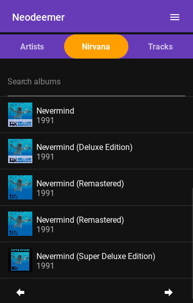

# Neodeemer
[](https://github.com/Tutislav/neodeemer/releases/latest)
[](https://github.com/Tutislav/neodeemer/releases/latest)
[](https://github.com/Tutislav/neodeemer/blob/main/LICENSE)

Multiplatform music downloader written in Python using framework Kivy.\
Available on **Android** and **Windows**.

## Features
- Search music on Spotify or YouTube
- Play music before you download it
- Add music to download queue
- Download whole Spotify or YouTube playlist with `.m3u` file
- It will automatically save track name, artist name, album image and other tags to songs (only Spotify)
## **[Download latest release](https://github.com/Tutislav/neodeemer/releases/latest)**

## Screenshots
<picture>
    <source media="(prefers-color-scheme: light)" srcset="img/neodeemer_screenshot_1_light.jpg">
    
</picture>
<picture>
    <source media="(prefers-color-scheme: light)" srcset="img/neodeemer_screenshot_2_light.jpg">
    
</picture>
<picture>
    <source media="(prefers-color-scheme: light)" srcset="img/neodeemer_screenshot_3_light.jpg">
    
</picture>
<picture>
    <source media="(prefers-color-scheme: light)" srcset="img/neodeemer_screenshot_4_light.jpg">
    
</picture>

## Running from source
Python 3.8.10 or later is required.
```
cd neodeemer
python -m venv venv
venv\Scripts\activate
pip install -r requirements.txt
```
You need to get your own [Spotify](https://developer.spotify.com/dashboard/) and [YouTube](https://developers.google.com/youtube/v3/getting-started) API keys and then create `.env` file like this:
```
SPOTIPY_CLIENT_ID=
SPOTIPY_CLIENT_SECRET=
YOUTUBE_API_KEY=
```
Then you can run this app.
```
python main.py
```

## Issues
If encounter some tracks, that has bad quality or even doesn't match the name, you can submit it directly in the app using
<picture>
    <source media="(prefers-color-scheme: light)" srcset="img/bug_outline_light.png">
    
</picture>
icon, when you select track.\
If you have other issue or some idea to make the app better, just open a new issue on GitHub.