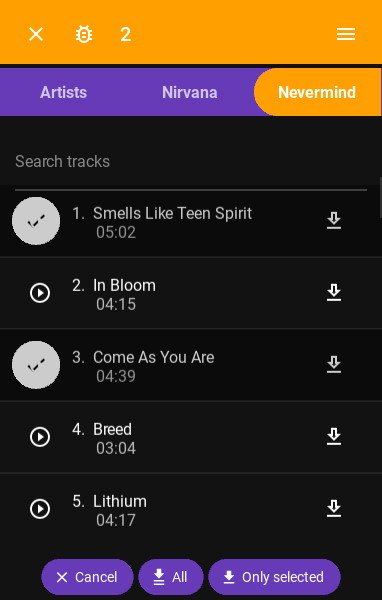

# Neodeemer
[](https://github.com/Tutislav/neodeemer/releases/latest)
[](https://github.com/Tutislav/neodeemer/releases/latest)
[](https://github.com/Tutislav/neodeemer/blob/main/LICENSE)

Multiplatform music downloader written in Python using framework Kivy.\
Available on **Android** and **Windows**.

## Features
- Search music on Spotify or YouTube
- Play music before you download it
- Add music to download queue
- Download whole Spotify or YouTube playlist with `.m3u` file
- It will automatically save track name, artist name, album image and other tags to songs (only Spotify)
## **[Download latest release](https://github.com/Tutislav/neodeemer/releases/latest)**

## Screenshots





## Running from source
Python 3.8.10 or later is required.
```
cd neodeemer
python -m venv venv
venv\Scripts\activate
pip install -r requirements.txt
```
You need to get your own [Spotify](https://developer.spotify.com/dashboard/) and [YouTube](https://developers.google.com/youtube/v3/getting-started) API keys and then create `.env` file like this:
```
SPOTIPY_CLIENT_ID=
SPOTIPY_CLIENT_SECRET=
YOUTUBE_API_KEY=
```
Then you can run this app.
```
python main.py
```

## Issues
If encounter some tracks, that has bad quality or even doesn't match the name, you can submit it directly in the app using
<svg style="width:20px;height:20px" viewBox="0 0 24 24">
    <path fill="currentColor" d="M20,8H17.19C16.74,7.2 16.12,6.5 15.37,6L17,4.41L15.59,3L13.42,5.17C12.96,5.06 12.5,5 12,5C11.5,5 11.05,5.06 10.59,5.17L8.41,3L7,4.41L8.62,6C7.87,6.5 7.26,7.21 6.81,8H4V10H6.09C6.03,10.33 6,10.66 6,11V12H4V14H6V15C6,15.34 6.03,15.67 6.09,16H4V18H6.81C8.47,20.87 12.14,21.84 15,20.18C15.91,19.66 16.67,18.9 17.19,18H20V16H17.91C17.97,15.67 18,15.34 18,15V14H20V12H18V11C18,10.66 17.97,10.33 17.91,10H20V8M16,15A4,4 0 0,1 12,19A4,4 0 0,1 8,15V11A4,4 0 0,1 12,7A4,4 0 0,1 16,11V15M14,10V12H10V10H14M10,14H14V16H10V14Z" />
</svg>
icon, when you select track.\
If you have other issue or some idea to make the app better, just open a new issue on GitHub.